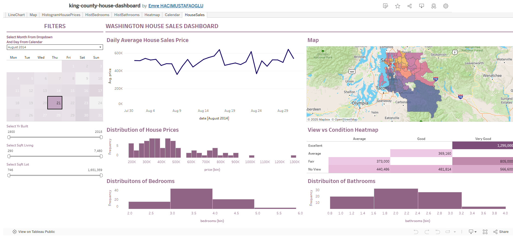

## 🖼️ Dashboard Preview

# 📊 King County House Sales — Interactive Tableau Dashboard

This project is an interactive Tableau dashboard built using the King County house sales dataset. It features calendar-based time filtering, geospatial mapping, detailed histograms, and a heatmap — all combined to provide a rich, visual exploration experience for real estate data.

🔗 **Live Dashboard**: [View on Tableau Public](https://public.tableau.com/views/king-county-house-dashboard/HouseSales?:language=en-US&:sid=&:redirect=auth&:display_count=n&:origin=viz_share_link)

---

## 🧠 Project Summary

Inspired by Mo Chen’s detailed tutorial, the dashboard showcases a multi-faceted design with an emphasis on user experience, data exploration, and filter logic. The project combines classic Tableau visuals with modern design choices and optional predictive modeling integration (Pecan).

---

## 🚀 Features

- 📅 **Calendar Widget Filtering** — Main interactive control for date-based exploration  
- 🗺️ **Map-Based Visualization** — ZIP code–level house price mapping  
- 📉 **Histograms** — Distribution of house prices, bedroom counts, and bathroom counts  
- 🌡️ **Heatmap** — View quality vs. condition comparison with color-coded pricing  
- 🎛️ **Scoped Filters** — Different filter scopes applied across chart groups for optimal interactivity  
- 🎨 **Design Enhancements** — Custom tooltips, aesthetic formatting, consistent color palette  
- ☁️ **Published on Tableau Public** — Fully shareable and cloud-hosted dashboard  

---

## 🧩 Technical Highlights

- Geospatial visualizations powered by Tableau’s built-in ZIP geocoding engine  
- Filter control using **Apply to: All Worksheets vs. Selected Worksheets** logic  
- Time-series analysis using line charts over filtered calendar selections  
- Responsive layout and enhanced readability through visual design principles  
- Integrated GIF previews and interactive tooltips for improved UX (in Tableau itself)

---

## 📌 Key Insights

- **Time-aware dashboards** significantly enhance decision-making for real estate data
- Using multiple visual types side-by-side enables holistic market understanding
- Tableau’s UI/UX choices directly influence end-user engagement and interpretability

---

## 🛠️ Tools Used

- Tableau Desktop / Tableau Public  
- Mapbox (for background mapping style)  
- King County House Sales Dataset (via tutorial)  
- Optional: Pecan AI integration (forecasting placeholder)

---

## ✅ Author Notes

This project demonstrates advanced dashboard design thinking beyond simple charting — integrating narrative flow, interactivity, and layout precision. It was built to deepen visualization fluency and show how business insights can be told through data storytelling.

